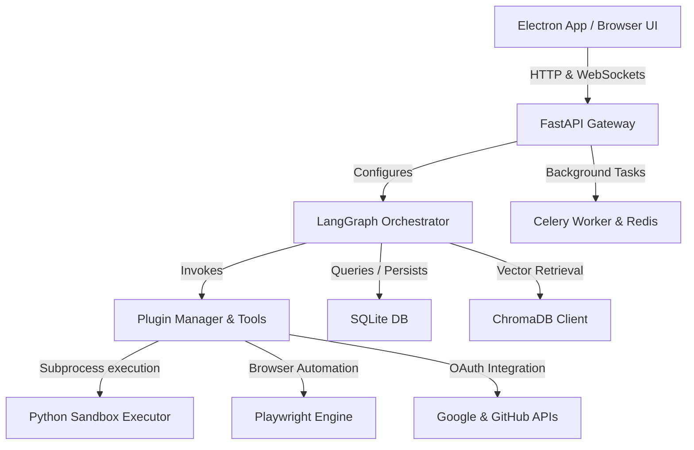
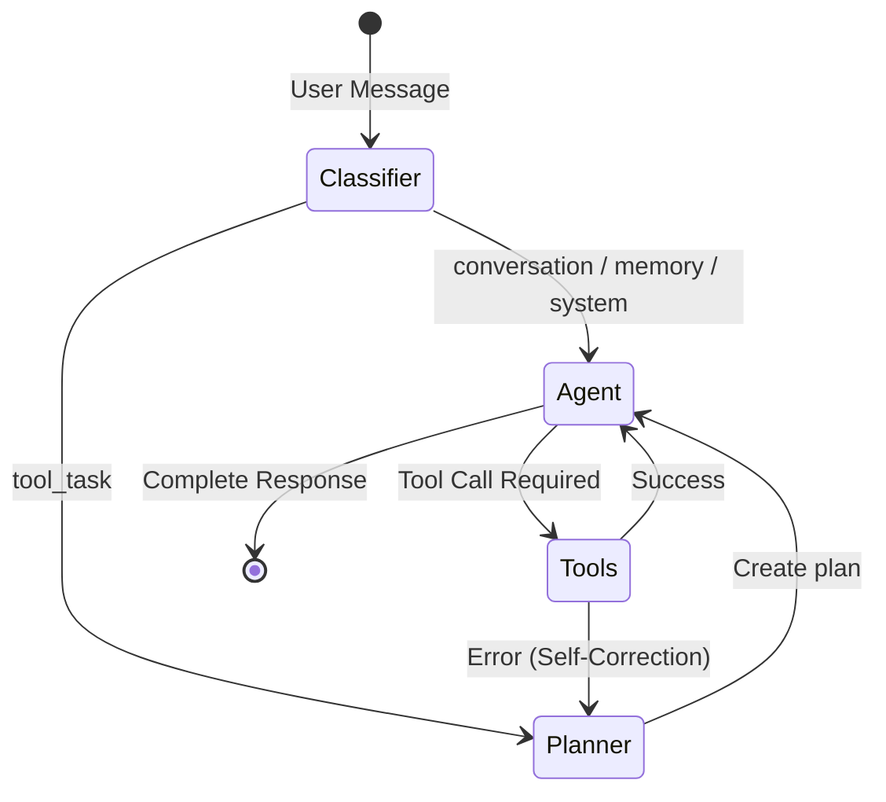

# JARVIS System Architecture

This document details the software design, folder organization, data persistence layouts, and execution flow of the **JARVIS AI Operating System**.

---

## 🏗️ System Components

The JARVIS grid is composed of five primary layers:

1. **Client Console**: Electron container wrap or a standard web page running a Next.js (React) front-end. Speaks to the API gateway via REST calls and full-duplex WebSockets.
2. **API Gateway**: FastAPI backend that hosts routes, handles Google OAuth login callbacks, manages open WebSockets, and validates user configurations.
3. **Agent Graph**: Compiled LangGraph state machine that routes, plans, reasons, and executes user tasks.
4. **Plugin Manager**: Tool registry that exposes system utilities, file access, and third-party APIs to the LLM.
5. **Background Workers**: Redis broker supporting Celery workers to handle heavy async tasks (e.g. background memory extraction, web scraping).

---

## 🗂️ Folder Structure Layout

### Python Backend (`/backend`)
* `app/api/v1/` — REST Router endpoints (`auth.py`, `chat.py`, `calendar.py`, `gmail.py`, `files.py`, `browser.py`, `agents.py`, `analytics.py`).
* `app/core/` — Core setups: `config.py` (Pydantic Settings loading `.env`), `database.py` (SQLAlchemy SQLModel connection), `security.py` (JWT & password hashing), `celery_app.py` (background tasks configuration).
* `app/models/` — DB schemas for SQLAlchemy (`user.py`, `conversation.py`, `task.py`, `audit.py`, `file.py`, `reminder.py`, `analytics.py`).
* `app/services/` — Business logic implementations: `agent_orchestrator.py` (LangGraph setup), `llm.py` (LLM router and client creation), `memory.py` (ChromaDB extraction & storage), `sandbox.py` (Python execution in isolation), `browser.py` (Playwright automation).
* `app/tools/` — Developer tool definitions (`registry.py`, `desktop.py`, `integrations.py`, `reminders.py`).
* `tests/` — Automated Pytest suite (`test_auth.py`, `test_chat_logic.py`, `test_agent_orchestrator.py`, `test_blackbox_api.py`).

### Next.js Frontend (`/frontend`)
* `src/app/` — Next.js 14 App Router layout structure and page nodes.
* `src/components/` — UI modules (Chat, Sidebar, Settings, Files, Analytics tabs).
* `src/hooks/` — Zustand store bindings (`useJarvisStore.ts`) and custom React hook bindings.
* `src/services/` — API clients (`api.ts`), WebSocket services (`websocket.ts`), local text-to-speech synthesisers (`VoiceManager.ts`).

---

## 🧠 LangGraph Orchestrator Flow

All chat interactions proceed through a compiled LangGraph `StateGraph` state machine to allow self-correcting execution:

1. **Intent Classification**: Classifies message context into `tool_task`, `memory_query`, `system_command`, or generic `conversation`.
2. **Planner Node**: If a tool is required, maps out a multi-step execution checklist (max 3 steps) returned to the client as telemetry.
3. **Agent reasoning**: The central cognitive loop. Binds registered LangChain tools to the active LLM. Evaluates plan state and selects next step.
4. **Tools Execution**: Executes the requested tool (either standard LangChain Tool or custom context-aware OAuth database handler).
5. **Self-Correction Edge**: If a tool execution fails, the graph passes control back to the Planner node to adjust parameters and retry (max 3 times to prevent loops).

---

## 💾 Database Schema Reference

The SQLite relational schema uses **SQLModel** (SQLAlchemy wrappers):

| Table Name | Model Name | Description | Key Fields |
| :--- | :--- | :--- | :--- |
| `users` | `User` | User profiles and API integrations | `id`, `email`, `role`, `groq_api_key`, `preferred_model` |
| `conversations` | `Conversation` | Chat conversation grouping | `id`, `user_id`, `title`, `created_at` |
| `messages` | `Message` | Chat log entries | `id`, `conversation_id`, `role`, `content`, `voice_url` |
| `agent_tasks` | `AgentTask` | Tracks background workspace tasks | `id`, `title`, `status`, `result`, `errors` |
| `browser_tasks` | `BrowserTask` | Tracks Playwright browser runs | `id`, `status`, `screenshot_url`, `extracted_text` |
| `audit_logs` | `AuditLog` | Auditing for tool execution safety | `id`, `user_id`, `action`, `status`, `duration_ms` |
| `reminders` | `Reminder` | Scheduled task triggers | `id`, `user_id`, `message`, `scheduled_at`, `is_delivered` |
| `token_usage_logs`| `TokenUsageLog`| Token cost optimization metrics | `id`, `model_name`, `prompt_tokens`, `completion_tokens` |
