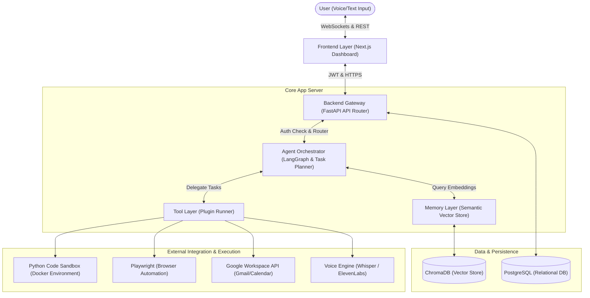
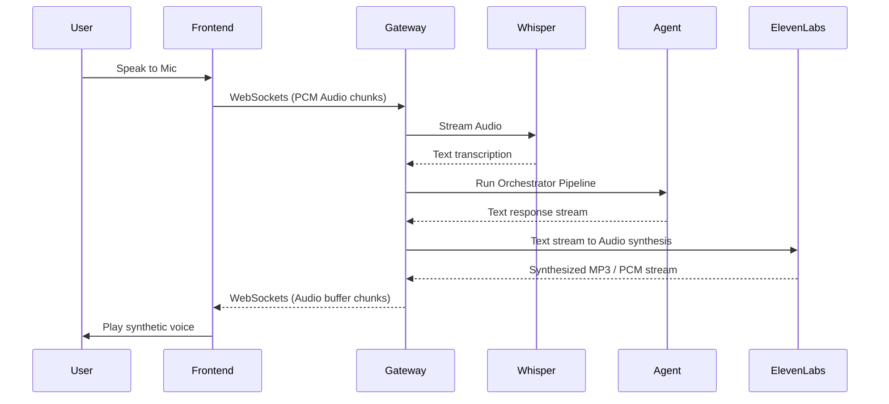
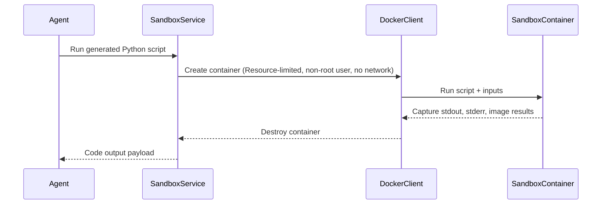

# Project Architecture Document
## Project Name: JARVIS – AI Operating System
**Version**: 1.0.0  
**Date**: 2026-06-05  

---

## 1. System Overview

JARVIS is designed around a multi-tier, modular microservice architecture. It combines a highly interactive frontend dashboard with an asynchronous FastAPI gateway that orchestrates stateful multi-agent pipelines, secure sandbox executors, database engines, and semantic memory layers.

### 1.1 Architectural Flow Diagram

The diagram below illustrates the layered approach from the user interface down to the persistent database engines:

---

## 2. Layer Component Details

### 2.1 Frontend Layer (Next.js & TailwindCSS)
- **Framework**: Next.js (utilizing App Router).
- **Styling**: TailwindCSS configured with a futuristic dark theme, glassmorphism UI classes, and smooth framer-motion transitions.
- **State Management**: Zustand for managing global application state (user auth sessions, websocket audio connections, and agent execution logs).
- **Voice Controller**: Web Audio API wrapper that streams microphone inputs to the backend via Websockets and plays incoming synthetic voice chunks sequentially.

### 2.2 Backend Gateway (FastAPI)
- **Router**: API Gateway routing requests to respective service managers.
- **Authentication Middleware**: FastAPI security dependencies validating JWT tokens on all requests except registration/login.
- **WebSocket Gateway**: High-performance connection manager streaming transcription events, agent execution status updates, and audio buffers in real-time.

### 2.3 Agent Orchestrator (LangGraph / Custom State Machine)
- **Role**: Breaks down the complex natural language queries into logical execution steps (DAG - Directed Acyclic Graph).
- **Core Orchestrator Loop**:
  1. *Analyze & Plan*: Understand prompt, review long-term memory contexts.
  2. *Select Tools*: Match plan sub-tasks to available tool plugins.
  3. *Execute & Monitor*: Trigger tools and parse results.
  4. *Evaluate & Adapt*: Check if tool execution output is valid. If a tool fails (e.g., compile error), generate correction steps and retry.
  5. *Summarize*: Synthesize all results to output format.

### 2.4 Tool Layer
The Tool Layer wraps various utilities as callable schemas:
- **Playwright service**: Runs browser routines headfully/headless to browse web targets.
- **Python Execution Sandbox**: A standalone docker client wrapper that schedules executions in isolated temporary docker containers.
- **Google API Connector**: Authenticates with OAuth parameters to pull Gmail notifications and set calendar events.
- **Web Search Engine**: Calls APIs like Tavily, Brave Search, or Google Search.

### 2.5 Memory Layer
- **Short-Term Memory**: Redis or in-memory array holding current conversational steps (window size = 15).
- **Long-Term Memory**: Custom semantic indexing system.
  - Queries are embedded using OpenAI's `text-embedding-3-small` or local HuggingFace embeddings.
  - Historical context is stored inside **ChromaDB**.
  - Important facts are summarized periodically using a background agent cron-job and stored as key-value tags in Postgres.

### 2.6 Database Layer
- **PostgreSQL**: Stores persistent application models:
  - Users: password hashes, profiles, OAuth state tokens.
  - Conversational Sessions: unique session metadata, session configurations.
  - Action & Execution Auditing: step-by-step logs showing which tools were executed, user permissions granted, and code run times.

---

## 3. Data & Communication Flows

### 3.1 Voice Chat Stream (WebSockets)

### 3.2 Code Execution Sandbox Flow
To protect the host server from malicious commands, the system isolates all dynamic code executions:

---

## 4. Security & Sandbox Details

- **Docker Sandbox Configuration**:
  - Memory limit: 256MB.
  - CPU usage: 0.5 cores max.
  - Disk Space: 50MB temporary workspace.
  - Network: Host network access disabled (`--network none`).
  - Read-Only root filesystem.
- **Permission Interceptors**:
  - The tool manager contains a manifest classifying tools as `SAFE` or `RESTRICTED`.
  - Calling a `RESTRICTED` tool (like modifying system configuration or sending email invitations) generates a UI notification prompting the user: `Allow JARVIS to run tool X? [Yes/No]`. Execution is suspended until user input is received.
